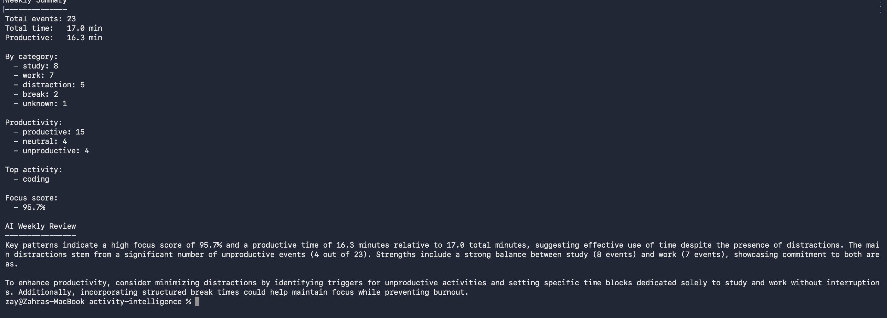
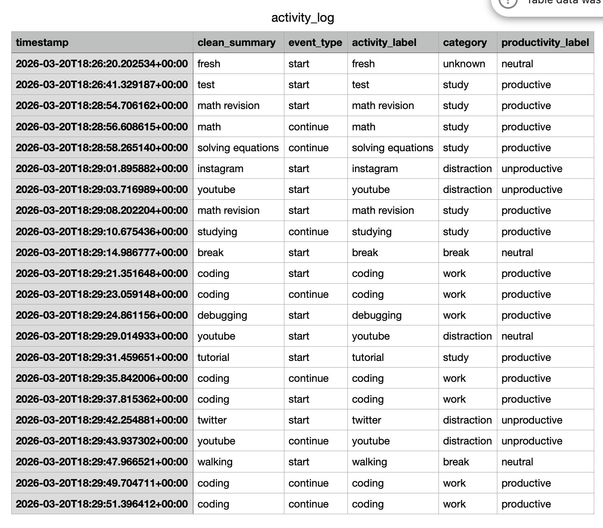
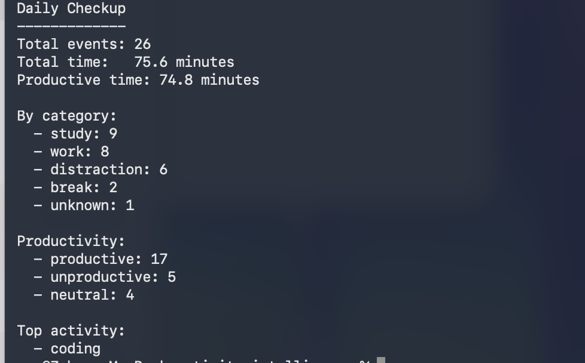

# activity-intelligence

A local command-line tool for logging what you're working on, classifying it with AI, and getting a clear daily and weekly breakdown of where your time actually went — with a full reminders system built in.

---

## What it is

You type what you're doing. It stores it, classifies it, and at the end of the week gives you a summary of how you spent your time — including an AI-written review of your focus patterns.

No timers. No categories to pre-define. Just log what you're doing in plain language and let the system figure out the rest.

---

## What it does

- Logs activities from the command line in natural language
- Uses OpenAI to classify each activity into a category
- Links each new event to the previous one to understand transitions
- Stores everything locally in SQLite
- Generates a weekly summary with time breakdowns and an AI review
- Runs a daily checkup showing today's events, category and productivity breakdown, and an optional AI summary
- Exports a clean CSV you can open in Numbers or Excel
- Tracks open work items separately — meaningful tasks like research, university work, writing, and personal projects
- **Reminders system** — add, list, and complete reminders from the terminal or via natural language
- **Daily Command Center** — one command shows your tasks, stale work, passive app usage, completed projects, and ideas
- **Passive activity tracking** — imports ActivityWatch data to show which apps you actually used and for how long
- **iCloud inbox sync** — log activities and reminders from iPhone Shortcuts; synced automatically via iCloud

---

## Why I made it

I kept losing track of where my time went. I'd end a week having been "busy" the whole time but couldn't say what I'd actually done or how focused I'd been. Most time-tracking tools require too much upfront setup or force you into rigid categories.

This is the version I actually wanted: type one line, get useful data back.

---

## How it works

1. **You log an activity** — a short plain-language description of what you're starting
2. **OpenAI classifies it** — assigns it a category (coding, learning, admin, etc.)
3. **The system links it** — each event records what came before it, so transitions are preserved
4. **It's saved to SQLite** — all events live in a local `activity.db` file
5. **Weekly summary** — run one command to get a time breakdown by category, plus an AI-written review of your week
6. **Daily checkup** — run anytime to see today's events, category breakdown, productivity split, and top activity
7. **CSV export** — export all events to a CSV file for analysis in Numbers or Excel
8. **Open work items** — meaningful activities are tracked as open work items with a title, tag, status, and progress context
9. **Reminders** — add reminders in plain English; OpenAI extracts the title, due date, and note automatically
10. **Day view** — a single command gives you your full day: tasks, stale work, passive app usage, and a focus suggestion

---

## Reminders

The reminders system lets you capture anything you need to do — from the terminal, from a natural-language sentence, or synced from your iPhone.

### Add a reminder from natural language (new)

```bash
python3 scripts/add_reminder_from_text.py "make the final dock cleanup by 24 march, maybe after lunch"
```

Example output:

```
Saved: Make the final dock cleanup  due: 2026-03-24 23:59
```

OpenAI extracts a clean title, an optional due date, and an optional note. Filler like "maybe" and "after lunch" is stripped. If no date is mentioned, `due_at` is left empty.

You can also run it interactively with no arguments:

```bash
python3 scripts/add_reminder_from_text.py
Reminder: submit the university essay by friday
Saved: Submit the university essay  due: 2026-03-27 23:59
```

### Add a reminder (structured)

```bash
python3 scripts/add_reminder.py "Review pull requests" --due "2026-03-25 10:00" --note "Focus on the auth module"
```

### List pending reminders

```bash
python3 scripts/list_reminders.py
```

Example output:

```
Pending Reminders
-----------------
- a3f1c2d4-...
  title: Make the final dock cleanup
  due:   2026-03-24 23:59:00
  note:  none

- b7e2a1f0-...
  title: Submit the university essay
  due:   2026-03-27 23:59:00
  note:  none
```

### Mark a reminder done

```bash
# By title
python3 scripts/done_reminder.py "Make the final dock cleanup"

# By id
python3 scripts/done_reminder.py a3f1c2d4-...
```

Example output:

```
Reminder marked done: Make the final dock cleanup
```

### Complete reminders from a summary (AI-powered)

Paste or type a plain-text summary of what you completed. OpenAI matches it against your pending reminders and marks the relevant ones done.

```bash
python3 scripts/complete_reminders_from_summary.py "finished the dock cleanup and submitted the essay"
```

Example output:

```
Matched reminders:
  - Make the final dock cleanup
  - Submit the university essay

Marked 2 reminders done.
```

### Sync reminders from iPhone (iCloud inbox)

Your iPhone Shortcut appends reminder titles to an iCloud text file. Run this to import them:

```bash
python3 scripts/ingest_reminder_inbox.py
```

Example output:

```
Found 3 reminder(s) in inbox. Importing...

  -> Call the dentist
  + saved: e1a2b3c4-...
  -> Buy groceries before Sunday
  + saved: f5d6e7f8-...
  -> Check gym schedule
  + saved: 09ab1cd2-...

3/3 reminder(s) imported.
Inbox cleared.
```

---

## Daily Command Center

Run `day` (or `python3 scripts/day.py`) to see a full snapshot of your day:

```
TODAY — Sunday, March 22
────────────────────────────────────────

🔥 Focus Today
  - Make the final dock cleanup  (due 2026-03-24)
  - Submit the university essay  (due 2026-03-27)
  - Review pull requests

⚠️  Later / Don't forget
  - Check gym schedule
  - Call the dentist

🧠 Resume
  - Refactor auth middleware  [6h ago]

🚀 Completed Projects

  Software & Tools
  - activity-intelligence CLI
  - Mac shortcut automation

  Research & Writing
  - Weekly focus analysis

💡 New Ideas

  Software & Tools
  - Passive screen time dashboard
  - One-tap focus mode

  Research & Writing
  - Deep work scheduling patterns

 Activity (today)
  - Cursor: 142 min
  - Safari: 38 min
  - Slack: 14 min
  - Notion: 9 min
  - YouTube: 7 min

→ Start with "Make the final dock cleanup".
```

Shell alias:

```bash
alias day='python3 /path/to/activity-intelligence/scripts/day.py'
```

---

## Passive activity tracking

Passive activity data is imported from ActivityWatch and stored in SQLite. View today's app usage:

```bash
python3 scripts/view_passive_today.py
```

Example output:

```
Passive Activity Today
----------------------
- Cursor: 142 min
- Safari: 38 min
- Slack: 14 min
- Notion: 9 min
- YouTube: 7 min

[debug] total passive time : 210 min
[debug] earliest timestamp : 2026-03-22 08:03:12
[debug] latest timestamp   : 2026-03-22 21:47:51
[debug] query window       : 2026-03-22 → 2026-03-23 (UTC)
```

---

## iCloud inbox sync (activities)

Log activities from your iPhone Shortcut into an iCloud text file. Import them on Mac with:

```bash
python3 scripts/ingest_activity_inbox.py
```

Example output:

```
Found 2 line(s) in inbox. Importing...

  → starting deep work session
  ✓ [start] deep work (building) → work item created: Deep work session [building]
  → took a break
  ✓ [switch] break (break)

2/2 activities imported.
Inbox cleared.
```

---

## Example workflow

```bash
# Start a new project — run intake first
aiintake

# Log what you're doing
log "starting math revision"
log "scrolling youtube"
log "back to coding"

# Add a reminder from natural language
python3 scripts/add_reminder_from_text.py "submit the assignment by friday night"

# See your full day at a glance
day

# View your weekly summary
week

# Run a daily checkup
checkup

# Export to CSV
exportlog
```

Running without aliases:

```bash
python3 main.py "starting math revision"
python3 -m app.analytics.weekly
python3 -m app.reports.daily_report
python3 scripts/export_csv.py
python3 scripts/day.py
```

---

## Screenshots

These are real outputs from the project.

**Terminal logging**


**Weekly summary**


**CSV in Numbers**


**Daily checkup**


**Open work items**


---

## Project structure

```
activity-intelligence/
├── main.py                               # Entry point — log a new activity
├── app/
│   ├── config.py                         # Environment and settings
│   ├── db.py                             # Database connection
│   ├── models/
│   │   ├── activity_event.py             # Event data model
│   │   ├── reminder_item.py              # Reminder data model
│   │   └── mobile_screen_time_event.py   # Screen time event model
│   ├── services/
│   │   ├── classifier.py                 # Category classification logic
│   │   └── ai_classifier.py             # OpenAI-powered classification
│   ├── storage/
│   │   ├── events.py                     # Read/write events to SQLite
│   │   ├── reminders.py                  # Read/write reminders to SQLite
│   │   └── mobile_screen_time.py         # Screen time storage
│   ├── analytics/weekly.py               # Weekly summary and AI review
│   └── reports/daily_report.py           # Daily checkup
├── scripts/
│   ├── add_reminder_from_text.py         # Add reminder from natural language (OpenAI)
│   ├── add_reminder.py                   # Add reminder with structured flags
│   ├── list_reminders.py                 # List all pending reminders
│   ├── done_reminder.py                  # Mark a reminder done by title or id
│   ├── complete_reminders_from_summary.py # AI-powered bulk completion
│   ├── ingest_reminder_inbox.py          # Import reminders from iCloud inbox
│   ├── ingest_activity_inbox.py          # Import activity logs from iCloud inbox
│   ├── ingest_screen_time.py             # Import screen time data
│   ├── view_passive_today.py             # View today's passive app usage
│   ├── day.py                            # Daily Command Center
│   ├── export_csv.py                     # Export events to CSV
│   ├── export_open_work_items_csv.py     # Export open work items to CSV
│   ├── watch_activity_inbox.py           # Watch iCloud activity inbox (file watcher)
│   ├── watch_reminder_inbox.py           # Watch iCloud reminder inbox (file watcher)
│   ├── watch_reminder_inbox_poll.py      # Watch iCloud reminder inbox (polling)
│   ├── watch_activitywatch_import.py     # Watch and import ActivityWatch data
│   ├── start_background_services.sh      # Start all background watchers
│   └── project_intake.py                # Project intake assistant
├── assets/
│   ├── commands/run-commands.md          # Quick command reference
│   └── screenshots/                      # Real output screenshots
└── data/
    └── activity.db                       # Local SQLite database (gitignored)
```

---

## Running the project

**1. Install dependencies**

```bash
pip install -r requirements.txt
```

**2. Add your API key**

Create a `.env` file in the project root:

```
OPENAI_API_KEY=your-key-here
```

**3. Log an activity**

```bash
python3 main.py "starting deep work session"
```

**4. Add a reminder from natural language**

```bash
python3 scripts/add_reminder_from_text.py "finish the report by thursday"
```

**5. View your day**

```bash
python3 scripts/day.py
```

**6. View weekly summary**

```bash
python3 -m app.analytics.weekly
```

**7. Run a daily checkup**

```bash
python3 -m app.reports.daily_report
```

**8. Export to CSV**

```bash
python3 scripts/export_csv.py
```

---

## Notes and limitations

- **Event-based, not time-tracking** — the system records when you log something, not how long you actually spent on it. Duration is inferred from the gap between events.
- **AI classifications can vary** — OpenAI's categorisation is good but not perfect. Ambiguous descriptions may be classified inconsistently.
- **Local and CLI-first** — there's no web interface, no sync, no mobile app. Everything runs on your machine.
- **You have to remember to log** — this doesn't run in the background. It only knows what you tell it. Passive tracking via ActivityWatch partially addresses this.

---

## Project intake

Before starting work on a new project (or when picking up an existing one), run:

```bash
aiintake
```

The tool reads any existing `project_context.md`, asks 4–5 focused questions in the terminal, then generates:

- **Project understanding** — a short summary of what the project is and where it stands
- **Open questions** — any gaps in what was described
- **Suggested project_context.md** — ready to copy into the file
- **Suggested current_step.md** — a next-step prompt for the AI build assistant

Save the output to a file for reference:

```bash
aiintake > intake.md
# or
python3 scripts/project_intake.py --save   # saves to data/intake_TIMESTAMP.md
```

Shell alias to add to `~/.zshrc`:

```bash
alias aiintake='python3 /path/to/activity-intelligence/scripts/project_intake.py'
```

---

## Future improvements

- Better session reconstruction — smarter handling of gaps, idle time, and end-of-day events
- Stronger weekly summaries — trend comparisons, best/worst focus days
- Mac Shortcut integration — single-input reminder flow using `add_reminder_from_text.py`
- Deeper analytics — streaks, category drift over time, time-of-day patterns
