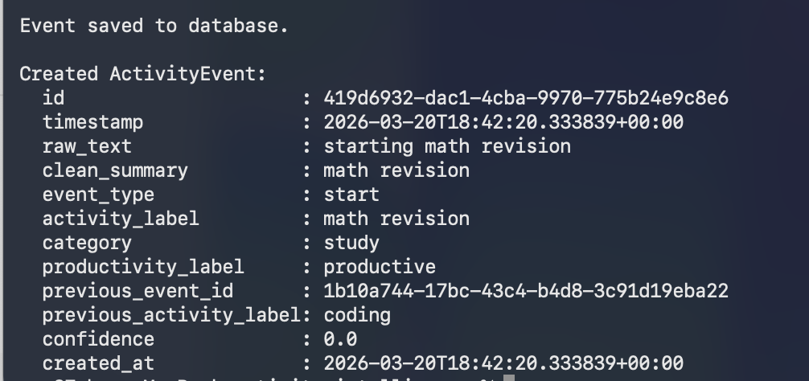
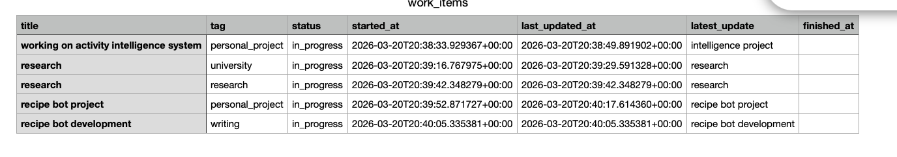

# activity-intelligence

You type what you're doing. It figures out the rest.

Log activities in plain English, get them classified by AI, and see exactly where your time went — daily and weekly. With a full reminders system built in.

No timers. No upfront categories. Just type and go.

---

## Why I built this

I kept ending weeks feeling "busy" but unable to say what I'd actually done. Most time-tracking tools want you to set up categories before you start, or run a timer in the background.

I wanted the opposite: log one line, get useful data back. This is that tool.

---

## What you can do with it

- **Log anything in plain English** — `"starting math revision"`, `"back to coding"`, `"took a break"`
- **Get AI classification** — OpenAI assigns a category, productivity label, and links each event to the last
- **See your day at a glance** — one command shows tasks, stale work, app usage, and a focus suggestion
- **Weekly summary** — time breakdown by category plus an AI-written review of your week
- **Reminders in natural language** — `"submit the essay by friday"` → saved with title and due date extracted
- **Passive app tracking** — imports ActivityWatch data so you know which apps you actually used
- **Log from your iPhone** — use an iPhone Shortcut to write to iCloud; auto-imported on Mac
- **Export to CSV** — open in Numbers or Excel for deeper analysis

---

## Get started

**1. Install dependencies**

```bash
pip install -r requirements.txt
```

**2. Add your OpenAI key**

```bash
# Create a .env file in the project root
OPENAI_API_KEY=your-key-here
```

**3. Log something**

```bash
python3 main.py "starting deep work session"
```

That's it. From there:

```bash
python3 scripts/day.py                  # See your full day
python3 -m app.analytics.weekly         # Weekly summary
python3 -m app.reports.daily_report     # Daily checkup
python3 scripts/export_csv.py           # Export to CSV
```

With shell aliases it gets even faster — see [Example workflow](#example-workflow) below.

---

## Reminders

Add reminders however feels natural.

**From a sentence:**
```bash
python3 scripts/add_reminder_from_text.py "make the final dock cleanup by 24 march, maybe after lunch"
# Saved: Make the final dock cleanup  due: 2026-03-24 23:59
```

OpenAI pulls out the title and due date. Filler like "maybe" and "after lunch" gets dropped.

**With structured flags:**
```bash
python3 scripts/add_reminder.py "Review pull requests" --due "2026-03-25 10:00" --note "Focus on the auth module"
```

**See what's pending:**
```bash
python3 scripts/list_reminders.py
```

```
Pending Reminders
-----------------
- a3f1c2d4-...
  title: Make the final dock cleanup
  due:   2026-03-24 23:59:00

- b7e2a1f0-...
  title: Submit the university essay
  due:   2026-03-27 23:59:00
```

**Mark one done:**
```bash
python3 scripts/done_reminder.py "Make the final dock cleanup"
# Reminder marked done: Make the final dock cleanup
```

**Bulk complete from a summary (AI-powered):**
```bash
python3 scripts/complete_reminders_from_summary.py "finished the dock cleanup and submitted the essay"
# Marked 2 reminders done.
```

**Sync from iPhone (iCloud inbox):**
```bash
python3 scripts/ingest_reminder_inbox.py
# Imports anything your iPhone Shortcut wrote to the iCloud inbox file
```

---

## Daily Command Center

Run `day` to get a full snapshot of where things stand:

```
TODAY — Sunday, March 22
────────────────────────────────────────

🔥 Focus Today
  - Make the final dock cleanup  (due 2026-03-24)
  - Submit the university essay  (due 2026-03-27)
  - Review pull requests

⚠️  Later / Don't forget
  - Check gym schedule
  - Call the dentist

🧠 Resume
  - Refactor auth middleware  [6h ago]

🚀 Completed Projects

  Software & Tools
  - activity-intelligence CLI
  - Mac shortcut automation

💡 New Ideas
  - Passive screen time dashboard
  - Deep work scheduling patterns

 Activity (today)
  - Cursor: 142 min
  - Safari: 38 min
  - Slack: 14 min

→ Start with "Make the final dock cleanup".
```

Add the alias to `~/.zshrc`:
```bash
alias day='python3 /path/to/activity-intelligence/scripts/day.py'
```

---

## Passive activity tracking

Pulls app usage data from ActivityWatch so you can see what you actually had open:

```bash
python3 scripts/view_passive_today.py
```

```
Passive Activity Today
----------------------
- Cursor: 142 min
- Safari: 38 min
- Slack: 14 min
- Notion: 9 min
- YouTube: 7 min
```

---

## iCloud inbox sync (activities)

Log activities from your iPhone using a Shortcut that writes to an iCloud text file. Import on Mac:

```bash
python3 scripts/ingest_activity_inbox.py
```

```
Found 2 line(s) in inbox. Importing...
  → starting deep work session  ✓
  → took a break  ✓
Inbox cleared.
```

---

## Project intake

Starting something new? Run intake first. It reads your `project_context.md`, asks a few questions, then spits out a fresh context file and a next-step prompt you can hand straight to an AI assistant.

```bash
python3 scripts/project_intake.py
# or save it:
python3 scripts/project_intake.py --save
```

---

## Example workflow

```bash
# Start a project
aiintake

# Log as you go
log "starting math revision"
log "scrolling youtube"
log "back to coding"

# Add a reminder
python3 scripts/add_reminder_from_text.py "submit the assignment by friday night"

# Check in on your day
day

# End of week
week
```

Without aliases:
```bash
python3 main.py "starting math revision"
python3 -m app.analytics.weekly
python3 -m app.reports.daily_report
python3 scripts/export_csv.py
python3 scripts/day.py
```

---

## Screenshots

**Terminal logging**


**Weekly summary**


**CSV in Numbers**


**Daily checkup**


**Open work items**


---

## Project structure

```
activity-intelligence/
├── main.py                               # Entry point — log a new activity
├── app/
│   ├── config.py                         # Environment and settings
│   ├── db.py                             # Database connection
│   ├── models/
│   │   ├── activity_event.py             # Event data model
│   │   ├── reminder_item.py              # Reminder data model
│   │   └── mobile_screen_time_event.py   # Screen time event model
│   ├── services/
│   │   ├── classifier.py                 # Keyword-based classification
│   │   └── ai_classifier.py             # OpenAI-powered classification
│   ├── storage/
│   │   ├── events.py                     # Read/write events to SQLite
│   │   ├── reminders.py                  # Read/write reminders to SQLite
│   │   └── mobile_screen_time.py         # Screen time storage
│   ├── analytics/weekly.py               # Weekly summary and AI review
│   └── reports/daily_report.py           # Daily checkup
├── scripts/
│   ├── add_reminder_from_text.py         # Add reminder from natural language
│   ├── add_reminder.py                   # Add reminder with structured flags
│   ├── list_reminders.py                 # List pending reminders
│   ├── done_reminder.py                  # Mark a reminder done
│   ├── complete_reminders_from_summary.py # AI-powered bulk completion
│   ├── ingest_reminder_inbox.py          # Import reminders from iCloud
│   ├── ingest_activity_inbox.py          # Import activity logs from iCloud
│   ├── ingest_screen_time.py             # Import screen time data
│   ├── view_passive_today.py             # View today's passive app usage
│   ├── day.py                            # Daily Command Center
│   ├── export_csv.py                     # Export events to CSV
│   ├── export_open_work_items_csv.py     # Export open work items to CSV
│   ├── watch_activity_inbox.py           # Watch iCloud activity inbox
│   ├── watch_reminder_inbox.py           # Watch iCloud reminder inbox
│   ├── watch_activitywatch_import.py     # Watch and import ActivityWatch data
│   ├── start_background_services.sh      # Start all background watchers
│   └── project_intake.py                # Project intake assistant
├── assets/
│   ├── commands/run-commands.md          # Quick command reference
│   └── screenshots/                      # Real output screenshots
└── data/
    └── activity.db                       # Local SQLite database (gitignored)
```

---

## Good to know

- **Duration is inferred, not measured** — the system records when you log, not how long you actually worked. Time between events is used as an estimate.
- **AI isn't perfect** — vague descriptions can get miscategorised. The more specific you are, the better.
- **Everything stays local** — SQLite on your machine. No cloud sync, no accounts.
- **You have to remember to log** — it only knows what you tell it. Passive tracking via ActivityWatch fills in some gaps.

---

## What's next

- Smarter gap handling — better reconstruction when you forget to log for a while
- Trend comparisons in weekly summaries — best/worst focus days over time
- Deeper analytics — streaks, category drift, time-of-day patterns
